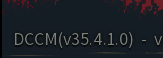

# Installing the DCCM Core

This tutorial will guide you through the installation process of the Dead Cells Core Modding (DCCM) core.

## Prerequisites

- **.NET 9 Runtime** ([Download Link](https://dotnet.microsoft.com/en-us/download/dotnet/9.0))
  - If you plan to **develop** mods for DCCM, please install the **.NET 9 SDK**.
- **Microsoft Visual C++ Redistributable (2015-2022)** ([Download Link](https://aka.ms/vs/17/release/vc_redist.x64.exe))

## Installation

### Getting the DCCM Core

You can download the latest DCCM core from the [Github Releases](https://github.com/dead-cells-core-modding/core/releases/latest) page.

If you wish to use new features that have not yet been officially released, [this one](https://nightly.link/dead-cells-core-modding/core/workflows/build/dev) might be more suitable for you.

### Installing the DCCM Core Files

Open the game's root directory from your file manager and create a folder named `coremod`. Extract the DCCM core files you obtained in the previous step into this folder.

:::tip
After completing the steps above, your directory structure should look like this:

```txt
<DeadCellsGameRoot>
├─ coremod
│  ├─ core
│  │  ├─ native
│  │  │  └─ …
│  │  ├─ mdk
│  │  │  ├─ install.ps1
│  │  │  ├─ uninstall.ps1
│  │  │  └─ …
│  │  ├─ host
│  │  │  ├─ startup
│  │  │  │  ├─ DeadCellsModding.exe
│  │  │  │  └─ …
│  │  │  └─ …
│  │  └─ …
│  └─ …
├─ deadcells.exe
├─ deadcells_gl.exe
└─ …
```

:::

:::tip
If you want, you can copy the `DeadCellsModding.exe` file to the game's root directory.
:::

## Launching the Game

Once you have completed the above steps, you can launch the modded game via `DeadCellsModding.exe`.

:::warning
After the initial installation or an update, the **first launch** may take a considerable amount of time to generate a cache (which may result in high memory usage).
:::

If everything goes smoothly, the DCCM version number will be displayed in the bottom-left corner of the game's main menu.


